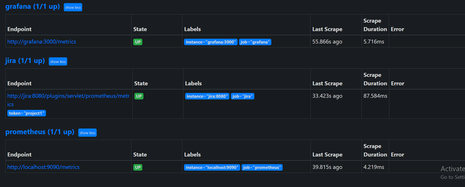
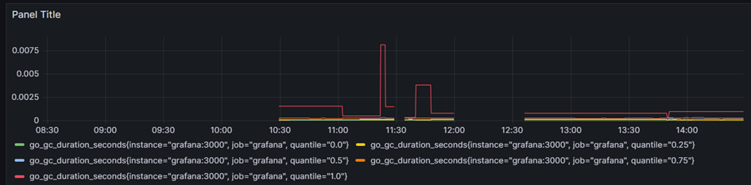
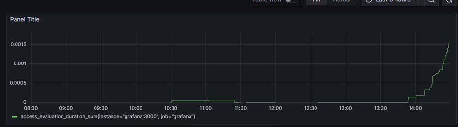

## Week4
## Tuesday Cases
## Case 1
- # Case: Yagiz wanted us to monitor jira with the Grafana and Prometheus.
- Step1: I wrote docker-compose file for jira, prometheus and grafana containers
- Step2: Container versions selected based on the compatibility
- Step3: Jira is linked on prometheus and it is linked on grafana for building dashboard
- Step4: Jira prometheus pluggin installed and linked to the prometheus container
- Step5: Prometheus connected with the token that specified on the prometheus.yml file
- Step6: Grafana connected with the url that given and requests successfully sent
- Step7: Dashboard has built with the queries that are created. 

Modules: 

Working Prometheus: 

Query: 

Dashboard Query1 : 

Dashboard Query2 : 